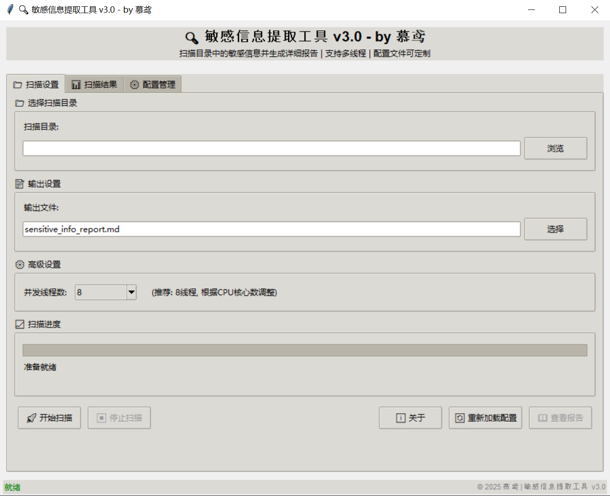
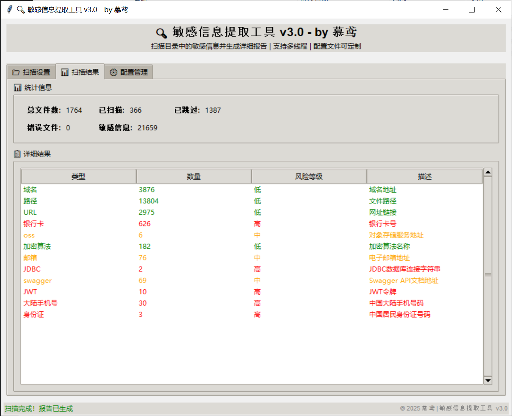

# 🔍 敏感信息提取工具

一个强大的敏感信息扫描工具，支持多线程处理和友好的GUI界面，可以扫描指定目录下的文件并提取敏感信息，主要解决内网渗透过程中，目标敏感文件过多，收集效率过低的问题。





## ✨ 主要特性

- **🎯 智能文件识别**：自动识别文本文件，跳过二进制文件
- **🚀 多线程处理**：支持2/4/8/16线程并发扫描，提升处理速度
- **🖼️ 用户友好界面**：基于tkinter的GUI界面，实时显示扫描进度
- **⚙️ 配置文件分离**：正则表达式规则存储在JSON配置文件中，便于修改
- **📊 详细报告**：生成格式化的Markdown报告，包含文件位置和行号
- **🔒 风险等级**：根据敏感信息类型标记风险等级（高/中/低）
- **🌍 多平台支持**：支持Windows、Linux、macOS打包成可执行文件

## 📦 项目结构

```
sensitive_info_extractor/
├── sensitive_extractor.py   # 主程序
├── patterns.json            # 正则表达式配置文件
├── build_script.py          # 打包脚本
├── requirements.txt         # 依赖列表
├── README.md                # 说明文档
└── release/                 # 发布包目录
    ├── windows/
    ├── linux/
    └── macos/
```

## 🚀 快速开始

### 方法一：直接运行Python脚本

1. **克隆项目**：
   ```bash
   git clone https://github.com/muyuanlove/sensitive_info_extractor
   cd sensitive_info_extractor
   ```

2. **安装依赖**：
   ```bash
   pip install -r requirements.txt
   ```

3. **运行程序**：
   ```bash
   python sensitive_extractor.py
   ```

### 方法二：使用预编译可执行文件

1. 下载对应平台的可执行文件 [windows](https://github.com/muyuanlove/sensitive_info_extractor/releases/tag/v3.0.0)
2. 解压到任意目录
3. 双击运行 `SensitiveInfoExtractor`

## 🔧 使用说明

### 基本操作

1. **选择扫描目录**：点击"浏览"按钮选择要扫描的目录
2. **设置输出文件**：指定报告文件的保存位置
3. **选择线程数**：根据CPU核心数选择合适的线程数
4. **开始扫描**：点击"开始扫描"按钮
5. **查看结果**：扫描完成后查看结果页面或生成的报告

### 界面介绍

- **📁 扫描设置**：配置扫描参数和查看进度
- **📊 扫描结果**：查看统计信息和详细结果
- **⚙️ 配置管理**：管理正则表达式规则

## 📝 配置文件说明

### patterns.json 结构

```json
{
  "规则名称": {
    "regex": "正则表达式",
    "description": "规则描述",
    "risk_level": "风险等级",
    "enabled": true
  }
}
```

### 支持的敏感信息类型

| 类型 | 描述 | 风险等级 |
|------|------|----------|
| 大陆手机号 | 中国大陆手机号码 | 🔴 高 |
| 身份证 | 中国居民身份证号码 | 🔴 高 |
| 银行卡 | 银行卡号 | 🔴 高 |
| JWT | JWT令牌 | 🔴 高 |
| 密钥 | 各类密钥 | 🔴 高 |
| 邮箱 | 电子邮箱地址 | 🟡 中 |
| OSS | 对象存储服务地址 | 🟡 中 |
| 域名 | 域名地址 | 🟢 低 |
| URL | 网址链接 | 🟢 低 |

### 自定义规则

1. 打开 `patterns.json` 文件
2. 添加新的规则或修改现有规则
3. 在程序中点击"重新加载配置"
4. 重新开始扫描

## 🛠️ 开发和打包

### 开发环境设置

```bash
# 创建虚拟环境
python -m venv venv

# 激活虚拟环境
# Windows
venv\Scripts\activate
# Linux/Mac
source venv/bin/activate

# 安装依赖
pip install -r requirements.txt
```

### 打包为可执行文件

```bash
# 执行打包脚本
python build.py
```

打包脚本会自动：
- 检查并安装PyInstaller
- 创建spec文件
- 构建可执行文件
- 创建发布包

## 📊 性能优化

### 线程数选择建议

- **2线程**：适合单核或双核CPU
- **4线程**：适合四核CPU
- **8线程**：适合八核CPU（推荐）
- **16线程**：适合高性能CPU

### 扫描效率

- 支持的文件类型：`.txt`, `.py`, `.js`, `.json`, `.yml`, `.md` 等
- 自动跳过二进制文件：`.exe`, `.jpg`, `.zip` 等
- 多编码支持：`UTF-8`, `GBK`, `GB2312` 等

## 🔒 安全说明

1. **隐私保护**：生成的报告可能包含敏感信息，请妥善保管
2. **文件权限**：程序只读取文件内容，不会修改任何文件
3. **网络安全**：程序不会上传任何数据到网络
4. **数据存储**：所有数据都存储在本地，不会泄露

## 📋 支持的平台

- ✅ Windows 10/11
- ✅ Linux (Ubuntu, CentOS, Debian等)
- ✅ macOS 10.15+

## 🐛 常见问题

### Q: 扫描速度很慢怎么办？
A: 可以增加线程数到8或16，跳过不必要的大文件夹。

### Q: 配置文件修改后不生效？
A: 需要点击"重新加载配置"按钮或重启程序。

### Q: 报告文件无法打开？
A: 确保输出路径有写入权限，报告格式为Markdown。

### Q: 可执行文件打包失败？
A: 检查是否安装了PyInstaller，确保Python环境正常。

## 🤝 贡献指南

1. Fork 项目
2. 创建特性分支
3. 提交更改
4. 推送到分支
5. 创建 Pull Request

## 📄 许可证

本项目采用 MIT 许可证 - 详见 [LICENSE](https://github.com/muyuanlove/sensitive_info_extractor/blob/main/LICENSE) 文件

## 🙏 致谢

感谢所有为此项目做出贡献的开发者！

---

**⚠️ 免责声明**：此工具仅用于安全检测和学习目的，请确保在合法合规的范围内使用。
